<div id="top"></div>
<!--
*** Thanks for checking out the Best-README-Template. If you have a suggestion
*** that would make this better, please fork the repo and create a pull request
*** or simply open an issue with the tag "enhancement".
*** Don't forget to give the project a star!
*** Thanks again! Now go create something AMAZING! :D
-->


<!-- PROJECT SHIELDS -->
<!--
*** I'm using markdown "reference style" links for readability.
*** Reference links are enclosed in brackets [ ] instead of parentheses ( ).
*** See the bottom of this document for the declaration of the reference variables
*** for contributors-url, forks-url, etc. This is an optional, concise syntax you may use.
*** https://www.markdownguide.org/basic-syntax/#reference-style-links
-->
[![Contributors][contributors-shield]][contributors-url]
[![Forks][forks-shield]][forks-url]
[![Stargazers][stars-shield]][stars-url]
[![Issues][issues-shield]][issues-url]
[![MIT License][license-shield]][license-url]
[![LinkedIn][linkedin-shield]][linkedin-url]


<!-- PROJECT LOGO -->
<br />
<div align="center">
  <a href="https://github.com/othneildrew/Best-README-Template">
    
  </a>

  <h3 align="center">Best-README-Template</h3>

  <p align="center">
    An awesome README template to jumpstart your projects!
    <br />
    <a href="https://github.com/othneildrew/Best-README-Template"><strong>Explore the docs »</strong></a>
    <br />
    <br />
    <a href="https://github.com/othneildrew/Best-README-Template">View Demo</a>
    ·
    <a href="https://github.com/othneildrew/Best-README-Template/issues">Report Bug</a>
    ·
    <a href="https://github.com/othneildrew/Best-README-Template/issues">Request Feature</a>
  </p>
</div>


<!-- TABLE OF CONTENTS -->
<details>
  <summary>Table of Contents</summary>
  <ol>
    <li>
      <a href="#visualisasi-data-kondisi-ketenagakerjaan-di-indonesia-selama-pandemi-covid-19-berbasis-web-dan-embed-dashboard-tableau">About The Project</a>
      <ul>
        <li><a href="#link-project">Link Project</a></li>
      </ul>
    </li>
    <li>
      <a href="#website">Website</a>
      <ul>
        <li><a href="#home">Home</a></li>
        <li><a href="#konsep-dan-definisi">Konsep dan Definisi</a></li>
        <li><a href="#visualisasi">Visualisasi</a></li>
      </ul>
    </li>
    <li>
      <a href="#dashboard">Dashboard</a>
      <ul>
        <li><a href="#preprocessing-data">Preprocessing Data</a></li>
        <li><a href="#visualisasi-line-chart">Visualisasi Line Chart</a></li>
        <li><a href="#visualisasi-peta-tematik">Visualisasi Peta Tematik</a></li>
        <li><a href="#tampilan-dashboard">Tampilan Dashboard</a></li>
        <li><a href="#tableau-public">Tableau Public</a></li>
        <li><a href="#embed-to-website">Embed to Website</a></li>
      </ul>
    </li>
    <li>
      <a href="#contact">Contact</a>
    </li>
  </ol>
</details>


<!-- ABOUT THE PROJECT -->
## Visualisasi Data Kondisi Ketenagakerjaan di Indonesia Selama Pandemi Covid-19 Berbasis Web dan Embed Dashboard Tableau

<p align="center">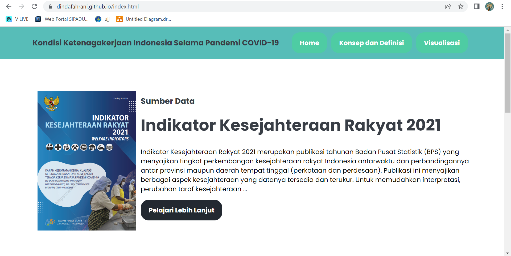</p>

Project ini menjelaskan tentang bagaimana cara membangun dashboard visualisasi data dinamis dengan menggunakan Tableau dan cara menanamkan (_embed_) dashboard tersebut ke dalam website yang telah dibangun. Data yang akan divisualisasikan adalah data Kondisi Ketenagakerjaan di Indonesia Selama Pandemi COVID-19 yang bersumber dari publikasi BPS yaitu [Indikator Kesejahteraan Rakyat 2021](https://www.bps.go.id/publication/2021/11/30/d34268e041d8bec0b25ba344/indikator-kesejahteraan-rakyat-2021.html#:~:text=Indikator%20Kesejahteraan%20Rakyat%202021%20merupakan,tinggal%20(perkotaan%20dan%20perdesaan).).

<p align="right">(<a href="#top">back to top</a>)</p>

### Link Project

Berikut adalah link menuju website dan tableau publik yang telah dibangun.

* Website : [Kondisi Ketenagakerjaan di Indonesia Selama Pandemi](https://dindafahrani.github.io/)
* [Tableau Public](https://public.tableau.com/views/KondisiKetenagakerjaanIndonesiaSelamaCOVID-19/KondisiKetenagakerjaanIndonesiaPadaMasaPandemiCOVID-19?:language=en-US&:display_count=n&:origin=viz_share_link)

Selanjutnya akan dijelaskan mengenai proses pembuatan website dan dashboard visualisasi data

<p align="right">(<a href="#top">back to top</a>)</p>


<!-- WEBSITE -->
## Website

Website yang telah dibuat berjudul "Kondisi Ketenagakerjaan Indonesia Selama Pandemi COVID-19" ini merupakan website yang bertujuan untuk menampilkan visualisasi dinamis dari hasil publikasi BPS. Website ini terdiri dari 3 halaman web yakni halaman [Home](https://dindafahrani.github.io/index.html), [Konsep dan Definisi](https://dindafahrani.github.io/konteks.html), dan [Visualisasi](https://dindafahrani.github.io/visual.html)

Setiap halaman dalam website, terdapat section `header` dan `footer`. Pada section `header` terdapat judul website dan ikon navigasi `Home`, `Konsep dan Definisi`, dan `Visualisasi` yang mengarahkan user kepada halaman yang dituju. Sedangkan pada section `footer`, terdapat copyright html.

Link menuju repository web : https://github.com/DindaFahrani/DindaFahrani.github.io 

<p align="right">(<a href="#top">back to top</a>)</p>


### Home

Pada halaman [Home](https://dindafahrani.github.io/index.html), terdapat 3 section, yaitu section `Sumber Data`, `Konsep dan Definisi`, dan `Visualisasi`.

* Section `Sumber Data` terdapat ikon `Pelajari Lebih Lanjut` yang apabila di klik maka akan menghubungkan user pada halaman resmi BPS tentang publikasi [Indikator Kesejahteraan Rakyat 2021](https://www.bps.go.id/publication/2021/11/30/d34268e041d8bec0b25ba344/indikator-kesejahteraan-rakyat-2021.html#:~:text=Indikator%20Kesejahteraan%20Rakyat%202021%20merupakan,tinggal%20(perkotaan%20dan%20perdesaan).)
* Section `Konsep dan Definisi` terdapat ikon `More` yang apabila di klik maka akan menghubungkan user pada halaman [Konsep dan Definisi](https://dindafahrani.github.io/konteks.html)
* Section `Visualisasi` terdapat ikon `More` yang apabila di klik maka akan menghubungkan user pada halaman [Visualisasi](https://dindafahrani.github.io/visual.html)

<p align="center"></p>
<p align="center">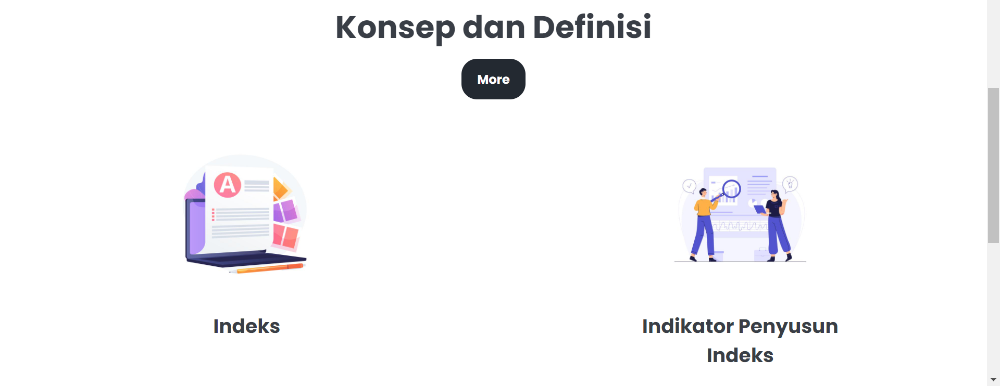</p>
<p align="center">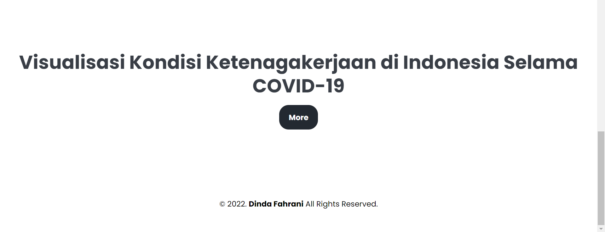</p>

<p align="right">(<a href="#top">back to top</a>)</p>

### Konsep dan Definisi

Halaman ini terdiri dari penjelasan mengenai sumber data yang digunakan dan juga konsep definisi variabel yang akan divisualisasikan

<p align="center">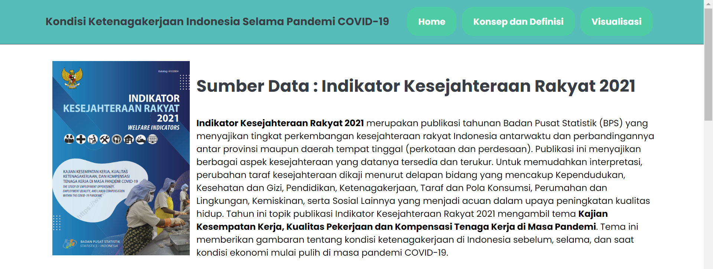</p>
<p align="center">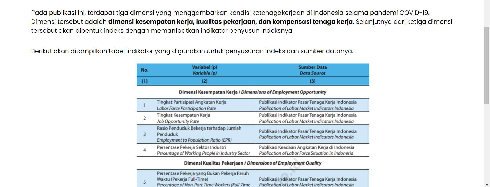</p>

<p align="right">(<a href="#top">back to top</a>)</p>


### Visualisasi

Halaman ini terdiri dari dashboard visualisasi data dinamis yang ditanamkan dari [Tabelau Public](https://public.tableau.com/views/KondisiKetenagakerjaanIndonesiaSelamaCOVID-19/KondisiKetenagakerjaanIndonesiaPadaMasaPandemiCOVID-19?:language=en-US&:display_count=n&:origin=viz_share_link)

<p align="center">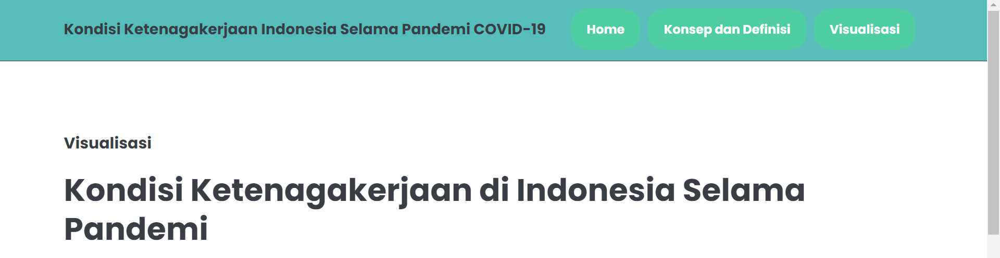</p>
<p align="center">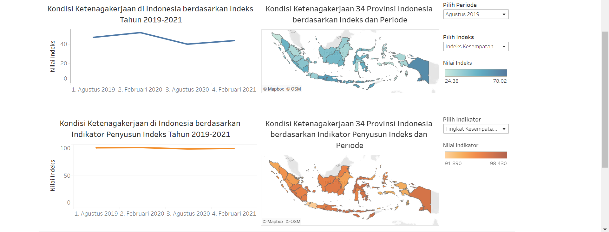</p>

<p align="right">(<a href="#top">back to top</a>)</p>

<!-- Dashboard -->
## Dashboard

Dashboard visualisasi data ini dibangun menggunakan Tableau, yang kemudian di simpan pada tableau public dan di tanamkan pada halaman website.

<p align="right">(<a href="#top">back to top</a>)</p>


### Preprocessing Data

Data yang akan divisualisasikan pada Tableau bersumber dari publikasi BPS yang berjudul Indikator Kesejahteraan Rakyat 2021. Pada publikasi tahun 2021 tersebut, BPS mengangkat tema mengenai kondisi ketenagakerjaan di Indonesia selama masa pandemi COVID-19 dengan melihat pada 3 dimensi, yaitu kesempatan kerja, kualitas pekerjaan, dan kompensasi tenaga kerja. Selanjutnya setiap dimensi tersebut akan dihitung indeks pada masing-masing dimensi. Perhitungan tersebut didasarkan atas indikator-indikator penyusunnya. Pada publikasi ini, tersedia data mengenai nilai indeks dan indikatornya, baik di level Indonesia, maupun di level provinsi. Selain itu, terdapat 4 referensi waktu yang dipakai pada publikasi tersebut, yaitu Agustus 2019, Februari 2020, Agustus 2020, dan Februari 2021. Referensi waktu ini menggambarkan periode waktu selama pandemi COVID-19. Berikut ditampilkan tabel dimensi dan indikator penyusunnya :

<p align="center">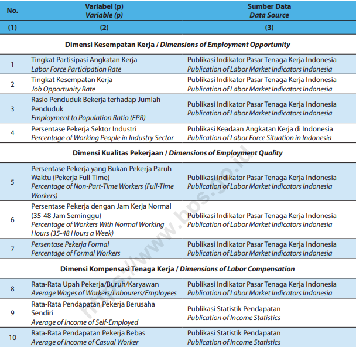</p>

Berdasarkan data yang tersedia, disusunlah data dalam file excel DATA1.xlsx. Didalamnya terdapat beberapa sheet, yaitu sheet yang berisi data nilai indeks dan indikator di 34 provinsi di Indonesia, dan sheet yang berisi data nilai indeks dan indikator di 34 Provinsi.

Berikut adalah data mengenai nilai indeks dan indikator di Indonesia dan periodenya :

<p align="center">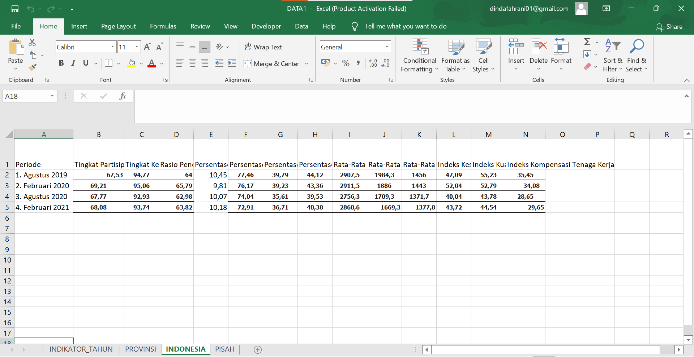</p>

Berikut adalah data mengenai nilai indeks dan indikator di 34 Provinsi di Indonesia berdasarkan periode :

<p align="center">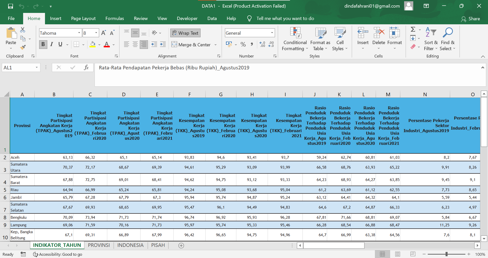</p>

Untuk lebih lengkapnya, bisa dilihat pada file DATA1.xlsx.

Selanjutnya file excel tersebut menjadi input pada workbook tableau. Logic yang digunakan adalah sebagai berikut :

<p align="center">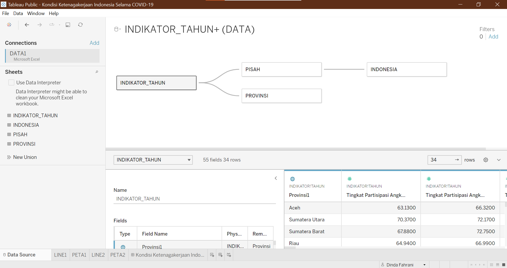</p>

Untuk kolom `Provinsi` geographyc role diubah menjadi state/province.

<p align="right">(<a href="#top">back to top</a>)</p>


### Visualisasi Line Chart

Visualisasi line chart ini digunakan untuk memvisualisasikan data indeks dan indikator di Indonesia berdasarkan periode waktu referensi. 

Berikut adalah hasil pembentukan line chart pada tableau :

* Worksheet LINE1 merupakan visualisasi Kondisi Ketenagakerjaan di Indonesia berdasarkan Indeks Tahun 2019-2021.

<p align="center">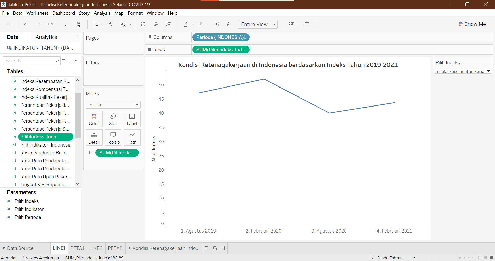</p>

* Worksheet LINE2 merupakan visualisasi Kondisi Ketenagakerjaan di Indonesia berdasarkan Indikator Penyusun Indeks Tahun 2019-2021.

<p align="center">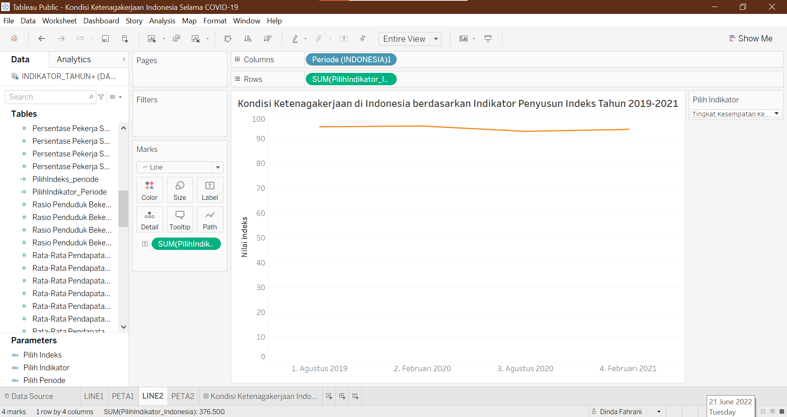</p>

Visualisasi data ini dibuat dinamis, sehingga pengguna dapat menentukan indeks/indikator yang ingin ditampilkan. Untuk dapat melakukan aksi tersebut, langkahnya adalah dengan membuat parameter baru sebagai berikut :

<p align="center">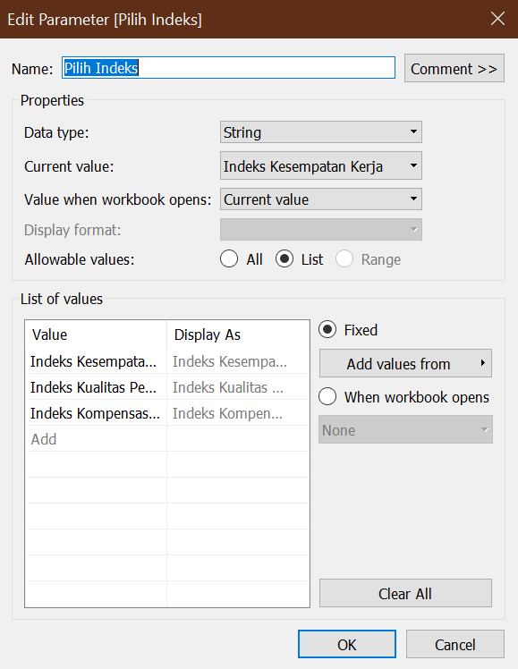
<p align="center">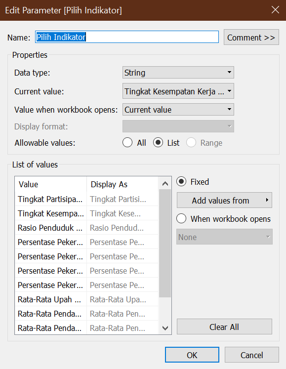

Selanjutnya tampilkan parameter. Untuk bisa melaukan aksi seperti apabila di klik maka muncul visualisasi data yang diinginkan maka kita melakukan Create Calculate Field dengan code sebagai berikut :

* Pilih Indeks
```
CASE [Pilih Indeks]
  WHEN "Indeks Kesempatan Kerja" THEN [Indeks Kesempatan Kerja (INDONESIA)]
  WHEN "Indeks Kualitas Pekerjaan" THEN [Indeks Kualitas Pekerjaan (INDONESIA)]
  WHEN "Indeks Kompensasi Tenaga Kerja" THEN [Indeks Kompensasi Tenaga Kerja (INDONESIA)]
END
```

* Pilih Indikator
```
CASE [Pilih Indikator]
WHEN "Tingkat Partisipasi Angkatan Kerja (TPAK)" THEN [Tingkat Partisipasi Angkatan Kerja (TPAK) (INDONESIA)]
WHEN "Tingkat Kesempatan Kerja (TKK)" THEN [Tingkat Kesempatan Kerja (TKK) (INDONESIA)]
WHEN "Rasio Penduduk Bekerja Terhadap Penduduk Usia Kerja" THEN [Rasio Penduduk Bekerja Terhadap Penduduk Usia Kerja (INDONESIA)]
WHEN "Persentase Pekerja Sektor Industri" THEN [Persentase Pekerja Sektor Industri (INDONESIA)]
WHEN "Persentase Pekerja Full Time" THEN [Persentase Pekerja Full Time (INDONESIA)]
WHEN "Persentase Pekerja dengan Jam Kerja Normal (35-48 Jam Seminggu)" THEN [Persentase Pekerja dengan Jam Kerja Normal (35-48 Jam Seminggu) (INDONESIA)]
WHEN "Persentase Pekerja Formal" THEN [Persentase Pekerja Formal (INDONESIA)]
WHEN "Rata-Rata Upah Pekerja/ Buruh/Karyawan (Ribu Rupiah)" THEN [Rata-Rata Upah Pekerja/ Buruh/Karyawan (Ribu Rupiah) (INDONESIA)]
WHEN "Rata-Rata Pendapatan Penduduk yang Berusaha Sendiri (Ribu Rupiah)" THEN [Rata-Rata Pendapatan Penduduk yang Berusaha Sendiri (Ribu Rupiah) (INDONESIA)]
WHEN "Rata-Rata Pendapatan Pekerja Bebas (Ribu Rupiah)" THEN [Rata-Rata Pendapatan Pekerja Bebas (Ribu Rupiah) (INDONESIA)]
END
```

Maka parameter yg kita buat sudah bisa dijalankan.

<p align="right">(<a href="#top">back to top</a>)</p>


### Visualisasi Peta Tematik

Visualisasi peta tematik ini digunakan untuk memvisualisasikan data indeks dan indikator di 34 provinsi di Indonesia berdasarkan periode waktu referensi. 

Berikut adalah hasil pembentukan peta tematik pada tableau :

* Worksheet PETA1 merupakan visualisasi Kondisi Ketenagakerjaan 34 Provinsi Indonesia berdasarkan Indeks dan Periode.

<p align="center">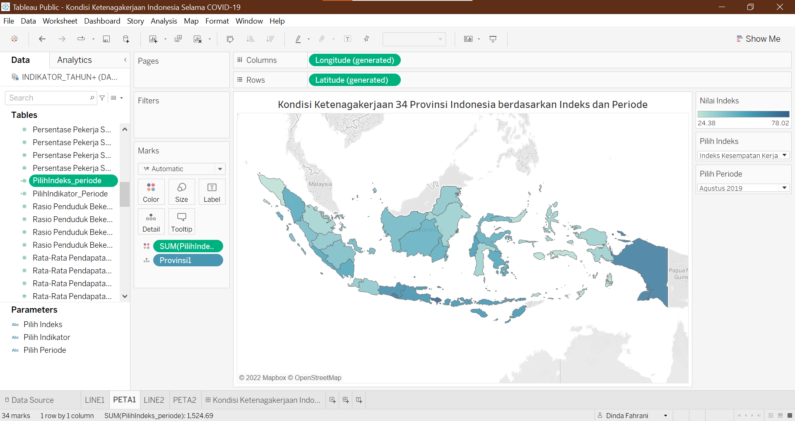</p>

* Worksheet PETA2 merupakan visualisasi Kondisi Ketenagakerjaan 34 Provinsi Indonesia berdasarkan Indikator Penyusun Indeks dan Periode.

<p align="center">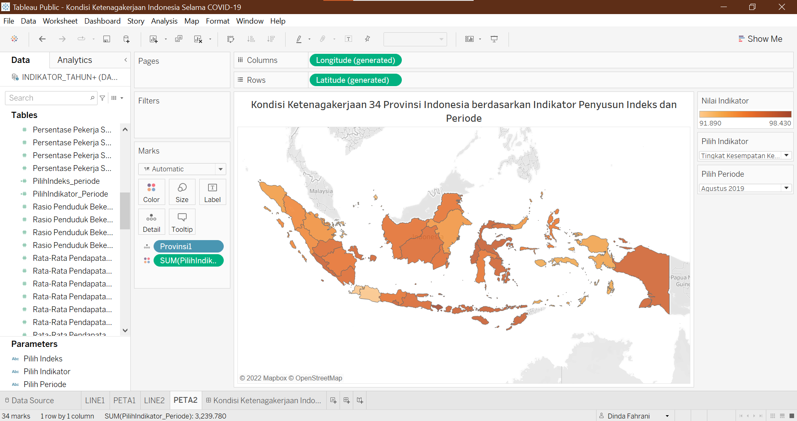</p>

Visualisasi data ini dibuat dinamis, sehingga pengguna dapat menentukan periode waktu referansi dan indeks/indikator yang ingin ditampilkan. Untuk dapat melakukan aksi tersebut, langkahnya adalah dengan membuat parameter baru sebagai berikut :

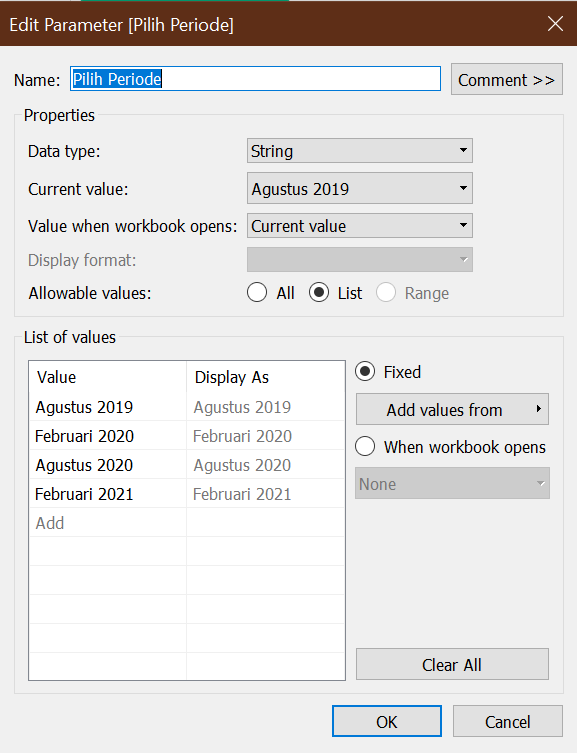


Selanjutnya tampilkan parameter. Untuk bisa melaukan aksi seperti apabila di klik maka muncul visualisasi data yang diinginkan maka kita melakukan Create Calculate Field dengan code sebagai berikut :

* Pilih Indeks dan Periode
  
```
IF [Pilih Indeks] = "Indeks Kesempatan Kerja" AND [Pilih Periode] = "Agustus 2019" THEN [Indeks Kesempatan Kerja Agustus2019]
ELSEIF  [Pilih Indeks] = "Indeks Kesempatan Kerja" AND [Pilih Periode] = "Februari 2020" THEN [Indeks Kesempatan Kerja Februari2020]
ELSEIF  [Pilih Indeks] = "Indeks Kesempatan Kerja" AND [Pilih Periode] = "Agustus 2020" THEN [Indeks Kesempatan Kerja Agustus2020]
ELSEIF  [Pilih Indeks] = "Indeks Kesempatan Kerja" AND [Pilih Periode] = "Februari 2021" THEN [Indeks Kesempatan Kerja Februari2021]
ELSEIF  [Pilih Indeks] = "Indeks Kualitas Pekerjaan" AND [Pilih Periode] = "Agustus 2019" THEN [Indeks Kualitas Pekerjaan Agustus2019]
ELSEIF  [Pilih Indeks] = "Indeks Kualitas Pekerjaan" AND [Pilih Periode] = "Februari 2020" THEN [Indeks Kualitas Pekerjaan Februari2020]
ELSEIF  [Pilih Indeks] = "Indeks Kualitas Pekerjaan" AND [Pilih Periode] = "Agustus 2020" THEN [Indeks Kualitas Pekerjaan Agustus2020]
ELSEIF  [Pilih Indeks] = "Indeks Kualitas Pekerjaan" AND [Pilih Periode] = "Februari 2021" THEN [Indeks Kualitas Pekerjaan Februari2021]
ELSEIF  [Pilih Indeks] = "Indeks Kompensasi Tenaga Kerja" AND [Pilih Periode] = "Agustus 2019" THEN [Indeks Kompensasi Tenaga Kerja Agustus2019]
ELSEIF  [Pilih Indeks] = "Indeks Kompensasi Tenaga Kerja" AND [Pilih Periode] = "Februari 2020" THEN [Indeks Kompensasi Tenaga Kerja Februari2020]
ELSEIF  [Pilih Indeks] = "Indeks Kompensasi Tenaga Kerja" AND [Pilih Periode] = "Agustus 2020" THEN [Indeks Kompensasi Tenaga Kerja Agustus2020]
ELSEIF  [Pilih Indeks] = "Indeks Kompensasi Tenaga Kerja" AND [Pilih Periode] = "Februari 2021" THEN [Indeks Kompensasi Tenaga Kerja Februari2021]
END
```

* Pilih Indikator Penyusun Indeks dan Periode
  
```
IF [Pilih Indikator] = "Tingkat Partisipasi Angkatan Kerja (TPAK)" AND [Pilih Periode] = "Agustus 2019" THEN [Tingkat Partisipasi Angkatan Kerja (TPAK) Agustus2019]
ELSEIF  [Pilih Indikator] = "Tingkat Partisipasi Angkatan Kerja (TPAK)" AND [Pilih Periode] = "Februari 2020" THEN [Tingkat Partisipasi Angkatan Kerja (TPAK) Februari2020]
ELSEIF  [Pilih Indikator] = "Tingkat Partisipasi Angkatan Kerja (TPAK)" AND [Pilih Periode] = "Agustus 2020" THEN [Tingkat Partisipasi Angkatan Kerja (TPAK) Agustus2020]
ELSEIF  [Pilih Indikator] = "Tingkat Partisipasi Angkatan Kerja (TPAK)" AND [Pilih Periode] = "Februari 2021" THEN [Tingkat Partisipasi Angkatan Kerja (TPAK) Februari2021]
ELSEIF  [Pilih Indikator] = "Tingkat Kesempatan Kerja (TKK)" AND [Pilih Periode] = "Agustus 2019" THEN [Tingkat Kesempatan Kerja (TKK) Agustus2019]
ELSEIF  [Pilih Indikator] = "Tingkat Kesempatan Kerja (TKK)" AND [Pilih Periode] = "Februari 2020" THEN [Tingkat Kesempatan Kerja (TKK) Februari2020]
ELSEIF  [Pilih Indikator] = "Tingkat Kesempatan Kerja (TKK)" AND [Pilih Periode] = "Agustus 2020" THEN [Tingkat Kesempatan Kerja (TKK) Agustus2020]
ELSEIF  [Pilih Indikator] = "Tingkat Kesempatan Kerja (TKK)" AND [Pilih Periode] = "Februari 2021" THEN [Tingkat Kesempatan Kerja (TKK) Februari2021]
ELSEIF  [Pilih Indikator] = "Rasio Penduduk Bekerja Terhadap Penduduk Usia Kerja" AND [Pilih Periode] = "Agustus 2019" THEN [Rasio Penduduk Bekerja Terhadap Penduduk Usia Kerja Agustus2019]
ELSEIF  [Pilih Indikator] = "Rasio Penduduk Bekerja Terhadap Penduduk Usia Kerja" AND [Pilih Periode] = "Februari 2020" THEN [Rasio Penduduk Bekerja Terhadap Penduduk Usia Kerja Februari2020]
ELSEIF  [Pilih Indikator] = "Rasio Penduduk Bekerja Terhadap Penduduk Usia Kerja" AND [Pilih Periode] = "Agustus 2020" THEN [Rasio Penduduk Bekerja Terhadap Penduduk Usia Kerja Agustus2020]
ELSEIF  [Pilih Indikator] = "Rasio Penduduk Bekerja Terhadap Penduduk Usia Kerja" AND [Pilih Periode] = "Februari 2021" THEN [Rasio Penduduk Bekerja Terhadap Penduduk Usia Kerja Februari2021]
ELSEIF  [Pilih Indikator] = "Persentase Pekerja Sektor Industri" AND [Pilih Periode] = "Agustus 2019" THEN [Persentase Pekerja Sektor Industri Agustus2019]
ELSEIF  [Pilih Indikator] = "Persentase Pekerja Sektor Industri" AND [Pilih Periode] = "Februari 2020" THEN [Persentase Pekerja Sektor Industri Februari2020]
ELSEIF  [Pilih Indikator] = "Persentase Pekerja Sektor Industri" AND [Pilih Periode] = "Agustus 2020" THEN [Persentase Pekerja Sektor Industri Agustus2020]
ELSEIF  [Pilih Indikator] = "Persentase Pekerja Sektor Industri" AND [Pilih Periode] = "Februari 2021" THEN [Persentase Pekerja Sektor Industri Februari2021]
ELSEIF  [Pilih Indikator] = "Persentase Pekerja Full Time" AND [Pilih Periode] = "Agustus 2019" THEN [Persentase Pekerja Full Time Agustus2019]
ELSEIF  [Pilih Indikator] = "Persentase Pekerja Full Time" AND [Pilih Periode] = "Februari 2020" THEN [Persentase Pekerja Full Time Februari2020]
ELSEIF  [Pilih Indikator] = "Persentase Pekerja Full Time" AND [Pilih Periode] = "Agustus 2020" THEN [Persentase Pekerja Full Time Agustus2020]
ELSEIF  [Pilih Indikator] = "Persentase Pekerja Full Time" AND [Pilih Periode] = "Februari 2021" THEN [Persentase Pekerja Full Time Februari2021]
ELSEIF  [Pilih Indikator] = "Persentase Pekerja dengan Jam Kerja Normal (35-48 Jam Seminggu)" AND [Pilih Periode] = "Agustus 2019" THEN [Persentase Pekerja dengan Jam Kerja Normal (35-48 Jam Seminggu) Agustus2019]
ELSEIF  [Pilih Indikator] = "Persentase Pekerja dengan Jam Kerja Normal (35-48 Jam Seminggu)" AND [Pilih Periode] = "Februari 2020" THEN [Persentase Pekerja dengan Jam Kerja Normal (35-48 Jam Seminggu) Februari2020]
ELSEIF  [Pilih Indikator] = "Persentase Pekerja dengan Jam Kerja Normal (35-48 Jam Seminggu)" AND [Pilih Periode] = "Agustus 2020" THEN [Persentase Pekerja dengan Jam Kerja Normal (35-48 Jam Seminggu) Agustus2020]
ELSEIF  [Pilih Indikator] = "Persentase Pekerja dengan Jam Kerja Normal (35-48 Jam Seminggu)" AND [Pilih Periode] = "Februari 2021" THEN [Persentase Pekerja dengan Jam Kerja Normal (35-48 Jam Seminggu) Februari2021]
ELSEIF  [Pilih Indikator] = "Persentase Pekerja Formal" AND [Pilih Periode] = "Agustus 2019" THEN [Persentase Pekerja Formal Agustus2019]
ELSEIF  [Pilih Indikator] = "Persentase Pekerja Formal" AND [Pilih Periode] = "Februari 2020" THEN [Persentase Pekerja Formal Februari2020]
ELSEIF  [Pilih Indikator] = "Persentase Pekerja Formal" AND [Pilih Periode] = "Agustus 2020" THEN [Persentase Pekerja Formal Agustus2020]
ELSEIF  [Pilih Indikator] = "Persentase Pekerja Formal" AND [Pilih Periode] = "Februari 2021" THEN [Persentase Pekerja Formal Februari2021]
ELSEIF  [Pilih Indikator] = "Rata-Rata Upah Pekerja/ Buruh/Karyawan (Ribu Rupiah)" AND [Pilih Periode] = "Agustus 2019" THEN [Rata-Rata Upah Pekerja/ Buruh/Karyawan (Ribu Rupiah) Agustus2019]
ELSEIF  [Pilih Indikator] = "Rata-Rata Upah Pekerja/ Buruh/Karyawan (Ribu Rupiah)" AND [Pilih Periode] = "Februari 2020" THEN [Rata-Rata Upah Pekerja/ Buruh/Karyawan (Ribu Rupiah) Februari2020]
ELSEIF  [Pilih Indikator] = "Rata-Rata Upah Pekerja/ Buruh/Karyawan (Ribu Rupiah)" AND [Pilih Periode] = "Agustus 2020" THEN [Rata-Rata Upah Pekerja/ Buruh/Karyawan (Ribu Rupiah) Agustus2020]
ELSEIF  [Pilih Indikator] = "Rata-Rata Upah Pekerja/ Buruh/Karyawan (Ribu Rupiah)" AND [Pilih Periode] = "Februari 2021" THEN [Rata-Rata Upah Pekerja/ Buruh/Karyawan (Ribu Rupiah) Februari2021]
ELSEIF  [Pilih Indikator] = "Rata-Rata Pendapatan Penduduk yang Berusaha Sendiri (Ribu Rupiah)" AND [Pilih Periode] = "Agustus 2019" THEN [Rata-Rata Pendapatan Penduduk yang Berusaha Sendiri (Ribu Rupiah) Agustus2019]
ELSEIF  [Pilih Indikator] = "Rata-Rata Pendapatan Penduduk yang Berusaha Sendiri (Ribu Rupiah)" AND [Pilih Periode] = "Februari 2020" THEN [Rata-Rata Pendapatan Penduduk yang Berusaha Sendiri (Ribu Rupiah) Februari2020]
ELSEIF  [Pilih Indikator] = "Rata-Rata Pendapatan Penduduk yang Berusaha Sendiri (Ribu Rupiah)" AND [Pilih Periode] = "Agustus 2020" THEN [Rata-Rata Pendapatan Penduduk yang Berusaha Sendiri (Ribu Rupiah) Agustus2020]
ELSEIF  [Pilih Indikator] = "Rata-Rata Pendapatan Penduduk yang Berusaha Sendiri (Ribu Rupiah)" AND [Pilih Periode] = "Februari 2021" THEN [Rata-Rata Pendapatan Penduduk yang Berusaha Sendiri (Ribu Rupiah) Februari2021]
ELSEIF  [Pilih Indikator] = "Rata-Rata Pendapatan Pekerja Bebas (Ribu Rupiah)" AND [Pilih Periode] = "Agustus 2019" THEN [Rata-Rata Pendapatan Pekerja Bebas (Ribu Rupiah) Agustus2019]
ELSEIF  [Pilih Indikator] = "Rata-Rata Pendapatan Pekerja Bebas (Ribu Rupiah)" AND [Pilih Periode] = "Februari 2020" THEN [Rata-Rata Pendapatan Pekerja Bebas (Ribu Rupiah) Februari2020]
ELSEIF  [Pilih Indikator] = "Rata-Rata Pendapatan Pekerja Bebas (Ribu Rupiah)" AND [Pilih Periode] = "Agustus 2020" THEN [Rata-Rata Pendapatan Pekerja Bebas (Ribu Rupiah) Agustus2020]
ELSEIF  [Pilih Indikator] = "Rata-Rata Pendapatan Pekerja Bebas (Ribu Rupiah)" AND [Pilih Periode] = "Februari 2021" THEN [Rata-Rata Pendapatan Pekerja Bebas (Ribu Rupiah) Februari2021]
END
```

Maka parameter yg kita buat sudah bisa dijalankan.

<p align="right">(<a href="#top">back to top</a>)</p>


### Tampilan Dashboard

Berikut adalah tampilan dashboard yang telah dibuat :

<p align="center">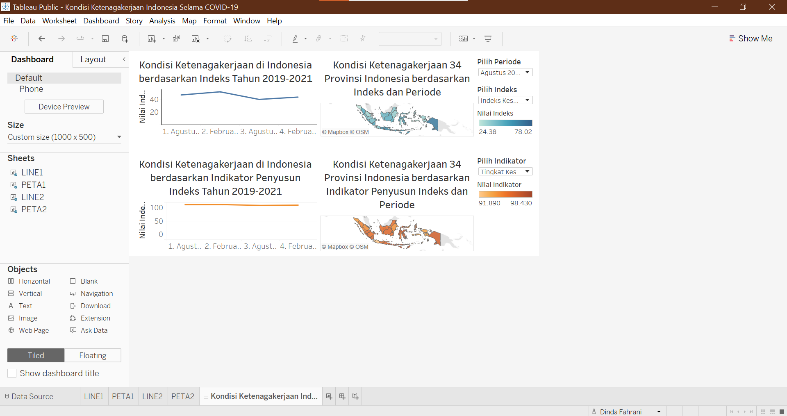</p>

Dashboard tersebut dibuat dengan ukuran 1000px x 500px disesuaikan dengan ukuran pada halaman website. Dashboard tersebut terdiri dari empat visualisasi yang telah dibuat yakni LINE1, LINE2, PETA1, dan PETA2. Tidak lupa ditampilkan pula parameternya yaitu pilih periode, pilih indeks, dan pilih indikator. Selain itu juga ditampilkan legenda dari peta tematiknya.

<p align="right">(<a href="#top">back to top</a>)</p>


### Tableau Public

Langkah selanjutnya adalah menyimpan workbook pada tableau public. Dashboard tersebut dapat diakses melalui link berikut : https://public.tableau.com/views/KondisiKetenagakerjaanIndonesiaSelamaCOVID-19/KondisiKetenagakerjaanIndonesiaPadaMasaPandemiCOVID-19?:language=en-US&:display_count=n&:origin=viz_share_link

<p align="right">(<a href="#top">back to top</a>)</p>


### Embed to Website

Kemudian kita tanamkan atau _embed_ dashboard visualisasi dari tableau ke dalam website kita. Dengan klik `share` kemudian _copy_ `embed code` dan _paste_ ke dalam file html yang dibuat.

<p align="center">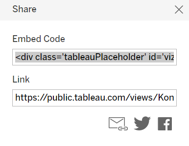</p>

<p align="right">(<a href="#top">back to top</a>)</p>


<!-- CONTACT -->
## Contact

Dinda Fahrani - dindafahrani01@gmail.com

Project Link: [https://github.com/DindaFahrani/dokumentasi-visdat](https://github.com/DindaFahrani/dokumentasi-visdat)

<p align="right">(<a href="#top">back to top</a>)</p>


<!-- MARKDOWN LINKS & IMAGES -->
<!-- https://www.markdownguide.org/basic-syntax/#reference-style-links -->
[contributors-shield]: https://img.shields.io/github/contributors/othneildrew/Best-README-Template.svg?style=for-the-badge
[contributors-url]: https://github.com/othneildrew/Best-README-Template/graphs/contributors
[forks-shield]: https://img.shields.io/github/forks/othneildrew/Best-README-Template.svg?style=for-the-badge
[forks-url]: https://github.com/othneildrew/Best-README-Template/network/members
[stars-shield]: https://img.shields.io/github/stars/othneildrew/Best-README-Template.svg?style=for-the-badge
[stars-url]: https://github.com/othneildrew/Best-README-Template/stargazers
[issues-shield]: https://img.shields.io/github/issues/othneildrew/Best-README-Template.svg?style=for-the-badge
[issues-url]: https://github.com/othneildrew/Best-README-Template/issues
[license-shield]: https://img.shields.io/github/license/othneildrew/Best-README-Template.svg?style=for-the-badge
[license-url]: https://github.com/othneildrew/Best-README-Template/blob/master/LICENSE.txt
[linkedin-shield]: https://img.shields.io/badge/-LinkedIn-black.svg?style=for-the-badge&logo=linkedin&colorB=555
[linkedin-url]: https://linkedin.com/in/othneildrew
[product-screenshot]: images/screenshot.png
